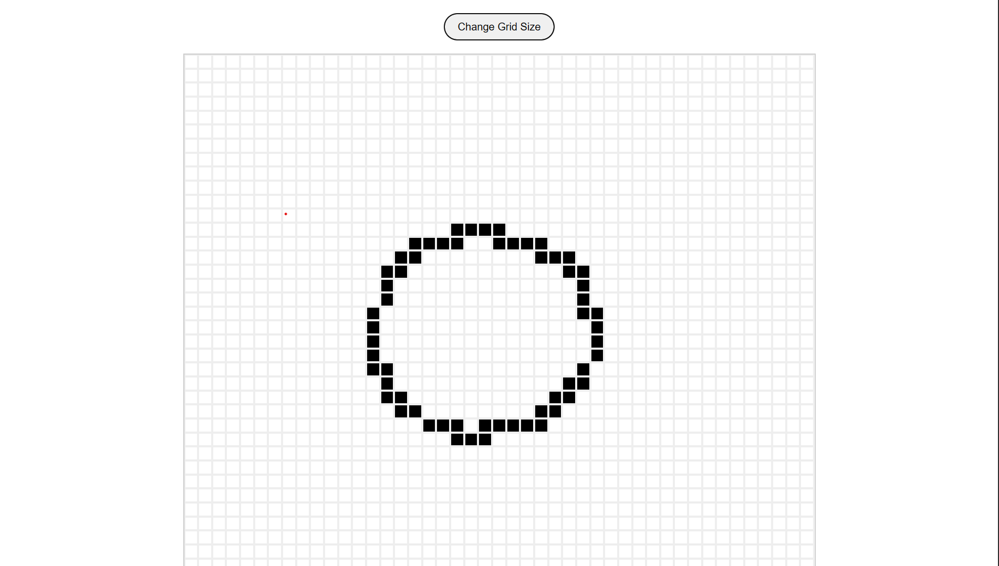

# Etch-a-Sketch 🎨

A browser-based sketchpad built with **HTML**, **CSS (Flexbox)**, and **JavaScript** — inspired by the classic Etch-a-Sketch toy. Hover over the grid to draw, resize the grid with a button, and enjoy a minimal pixel-art experience.

> 💡 The core logic — from grid generation to hover interactivity and resizing — is implemented entirely in **JavaScript**, making this project a hands-on exercise in DOM manipulation and dynamic UI rendering.

---

## 🔗 Live Demo

🎮 Try it here: [etch-a-sketch-aryan.netlify.app](https://etch-a-sketch-aryan.netlify.app/)

---

## 🖼️ Preview



---

## 🎯 Objective

The goal of this project was to apply and practice key front-end concepts — especially **DOM manipulation using JavaScript**, **Flexbox layout**, and **interactive event handling** — by building a dynamic sketchpad from scratch.

This project was inspired by and built as part of [The Odin Project](https://www.theodinproject.com/) curriculum.

---

## ✨ Features

- 🧱 **Grid-based sketchpad** generated dynamically via JavaScript
- 🎨 **Mouseover sketching effect** — hover to draw
- 🧮 **Custom grid resizing** via prompt (up to 100×100)
- 🧰 **Responsive layout** using CSS Flexbox
- 🧼 Clean, minimalist UI

---

## 🛠️ Built With

- **HTML5** – Semantic structure
- **CSS3 (Flexbox)** – Layout and styling
- **JavaScript (Vanilla)** – Core interactivity and logic
- **Git & GitHub** – Version control
- **Netlify** – Live deployment

---
## 📁 Folder Structure
```
Etch-a-Sketch/
│
├── index.html         # Main HTML file
├── style.css          # CSS styles using Flexbox
├── script.js          # JavaScript logic for grid and interaction
├── sources/
│   └── preview.png    # Screenshot preview of the app
├── LICENSE
└── README.md
```

---

## 📝 License

This project is licensed under the [MIT License](LICENSE).

---

## 🙌 Acknowledgments

- This project is based on the [Etch-a-Sketch assignment](https://www.theodinproject.com/lessons/foundations-etch-a-sketch) from [The Odin Project](https://www.theodinproject.com/).
- Built as part of my front-end learning journey 🌱

---